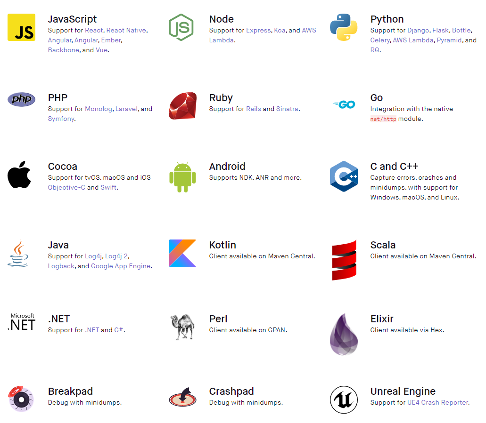
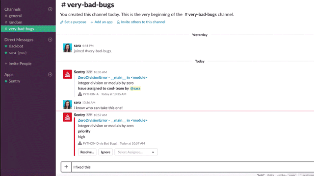
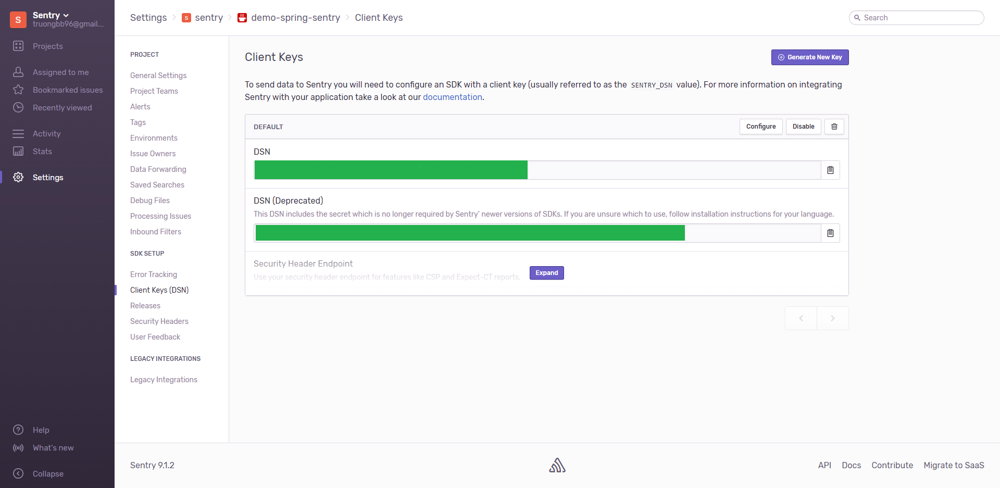
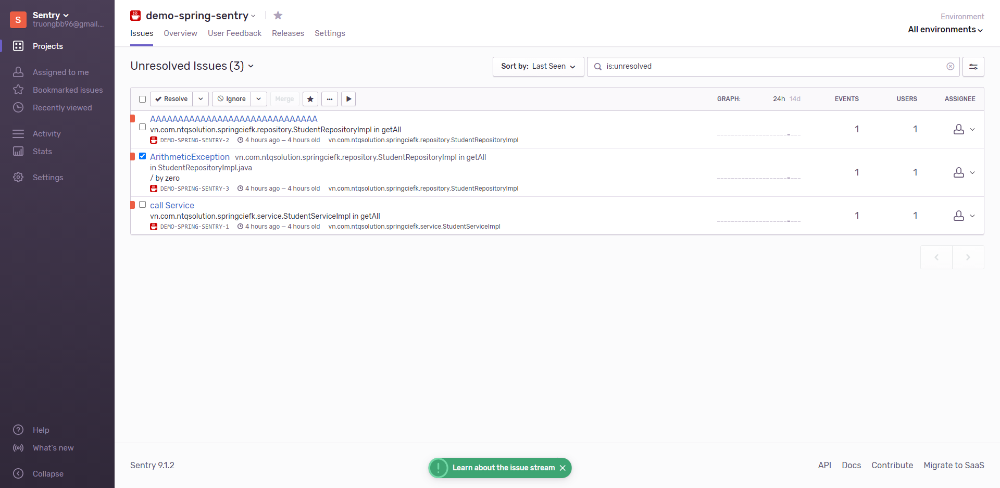
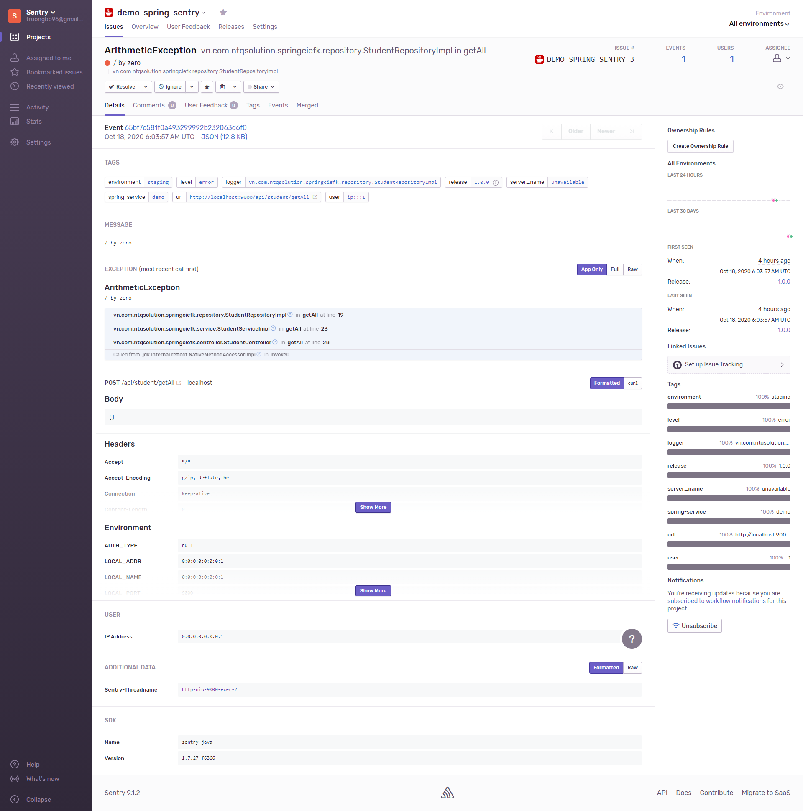

# simple-sentry-docker


## 1. What is Sentry?

> [Sentry](https://sentry.io) fundamentally is a service that helps you monitor and fix crashes in realtime. The server is in Python, but it contains a full API for sending events from any language, in any application.


## 2. Sentry supported languages

Sentry supports a lot of programming languages listed in the following image:



## 3. Integration/plugin

Sentry is the error catching system, besides that, integration is the extra features of Sentry. Sentry can integrate many other systems, platforms:

### 3.1 official intergation/plugin

- [Slack integration](https://github.com/getsentry/sentry-slack) for Sentry
- Sentry integration for creating [Redmine issues](https://github.com/getsentry/sentry-redmine)
- Plugin for sentry that lets you create [JIRA issues](https://github.com/getsentry/sentry-jira)
- Plugin for Sentry that creates cards on a [Trello board](https://github.com/getsentry/sentry-trello)
- Sentry extension which integrates with [GitHub](https://github.com/getsentry/sentry-github)
- Sentry extension which integrates with [Bitbucket](https://github.com/getsentry/sentry-bitbucket)
- Sentry extension which integrates with [Phabricator](https://github.com/getsentry/sentry-phabricator)
- Sentry plugin for integrating with [PagerDuty](https://github.com/getsentry/sentry-pagerduty)
- Sentry plugin that integrates with [Teamwork](https://github.com/getsentry/sentry-teamwork)
- Sentry extension which integrates [Heroku release tracking](https://github.com/getsentry/sentry-heroku)
- Sentry extension which integrates with [Freight release tracking](https://github.com/getsentry/sentry-freight)
- Sentry extension which integrates with [YouTrack](https://github.com/getsentry/sentry-youtrack)
- Plugin for Sentry that logs errors to an [IRC room](https://github.com/getsentry/sentry-irc)
- Sentry plugin for sending notifications to [Campfire](https://github.com/getsentry/sentry-campfire)
- Plugin for Sentry that logs errors to an IRC room on [Grove.io](https://github.com/getsentry/sentry-groveio)
- Plugin for Sentry which sends errors to [irccat](https://github.com/getsentry/sentry-irccat) (or any other service which supports irccat's simple socket-based protocol)




### 3.2 Other unofficial sentry integration/plugin

- Sentry plugin that integrates with [Hipchat](https://github.com/linovia/sentry-hipchat)
- Plugin for Sentry which allows sending notification via [Telegram messenger](https://github.com/butorov/sentry-telegram)
- A plugin for Sentry that sends SMS notifications via [Twilio](https://github.com/mattrobenolt/sentry-twilio)
- An Apache [Kafka plugin](https://github.com/Banno/getsentry-kafka) for Sentry


## 4. Simple Sentry docker

- Step 1: First, create a `docker-compose.yml` file:

```yml
version: "3.3"

volumes:
  pgdb:

services:
  redis:
    image: redis

  postgres:
    image: postgres
    environment:
      POSTGRES_USER: sentry
      POSTGRES_PASSWORD: sentry
      POSTGRES_DB: sentry
    volumes:
      - pgdb:/var/lib/postgresql/data

  sentry:
    image: sentry
    links:
      - redis
      - postgres
    ports:
      - 9000:9000
    environment:
      SENTRY_SECRET_KEY: "!!!SECRET!!!"
      SENTRY_POSTGRES_HOST: postgres
      SENTRY_DB_USER: sentry
      SENTRY_DB_PASSWORD: sentry
      SENTRY_REDIS_HOST: redis

  cron:
    image: sentry
    links:
      - redis
      - postgres
    command: "sentry run cron"
    environment:
      SENTRY_SECRET_KEY: "!!!SECRET!!!"
      SENTRY_POSTGRES_HOST: postgres
      SENTRY_DB_USER: sentry
      SENTRY_DB_PASSWORD: sentry
      SENTRY_REDIS_HOST: redis

  worker:
    image: sentry
    links:
      - redis
      - postgres
    command: "sentry run worker"
    environment:
      SENTRY_SECRET_KEY: "!!!SECRET!!!"
      SENTRY_POSTGRES_HOST: postgres
      SENTRY_DB_USER: sentry
      SENTRY_DB_PASSWORD: sentry
      SENTRY_REDIS_HOST: redis

```

Please change the `SENTRY_SECRET_KEY` to random 32 characters string.

- Step 2: After that, bring all the containers up by using `docker-compose up -d`.

- Step 3: Run `docker-compose exec sentry sentry upgrade` to setup database and create admin user.

- Step 4: (Optional) Run `docker-compose exec sentry pip install sentry-slack` if you want [Slack plugin](https://github.com/getsentry/sentry-slack), it can be done later.

- Step 5: Run `docker-compose restart sentry`.

And Sentry is now running on public port `9000`. Login by account you've created in `step 3`.


## 5. Sentry catchs Spring boot error

In this section, we're going to discuss about the Spring boot project errors are catched by Sentry.
First of all, you need create a project in your Sentry management page. In this circumstance, I've create java project. Next, create a Spring boot project and add these following libraries in `pom.xml`:

```xml
<dependency>
    <groupId>io.sentry</groupId>
    <artifactId>sentry-spring</artifactId>
    <version>1.7.27</version>
</dependency>
<dependency>
    <groupId>io.sentry</groupId>
    <artifactId>sentry-logback</artifactId>
    <version>1.7.27</version>
</dependency>
```

Then create a `sentry.properties` file in `resource` folder:

```properties
release=1.0.0
environment=staging
tags=spring-service:demo

stacktrace.app.packages=<your package you want to catch errors>

async.queuesize=100
timeout=1000
```

Of course, you need fill in the `stacktrace.app.packages` by your package.

Next step, you need to create logback config file - `logback-spring.xml`:

```xml
<configuration>
    <!--    Include spring boot default config-->
    <include resource="org/springframework/boot/logging/logback/base.xml"/>

    <!--    Configure the Sentry appender, overriding the logging threshold to the WARN level -->
    <appender name="Sentry" class="io.sentry.logback.SentryAppender">
        <filter class="ch.qos.logback.classic.filter.ThresholdFilter">
            <level>ERROR</level>
        </filter>
    </appender>

    <!--    Enable the Console and Sentry appenders, Console is provided as an example
        of a non-Sentry logger that is set to a different logging threshold -->
    <root level="INFO">
        <appender-ref ref="Sentry" />
    </root>
</configuration>
```

And the latest, create Sentry bean in Spring container by creating `SentryConfiguration`:

```java
/**
 * Sentry configuration
 *
 * @author truongbb
 * @see "https://docs.sentry.io/clients/java/integrations/#spring"
 */
@Slf4j
@Configuration
public class SentryConfiguration {

    @PostConstruct
    public void init() {
        String sentryDSN = "<your sentry DSN>";
        log.info("Init Sentry: {}", sentryDSN);
        Sentry.init(sentryDSN);
    }

    @Bean
    public HandlerExceptionResolver sentryExceptionResolver() {
        return new SentryExceptionResolver();
    }

    @Bean
    public ServletContextInitializer sentryServletContextInitializer() {
        return new SentryServletContextInitializer();
    }

}
```
With the `sentryDSN` you can take from your Sentry project by go to Project >> Setting >> Client Keys (DSN):



The `sentryDSN` looks like `http(s)://<a random string>@<your sentry server IP>:9000/<a number>`.

I recommend puting your DSN in a file and save in your server, don't paste to source code like me (I just do a simple demo), and using Java read that file value.


You can add custom data to get more information (request data - to statistic bug in the clients, user agent, ...), especially in the `filter` class in Spring boot, should add as soon as possible:

```java
Sentry.getContext().setUser(new UserBuilder().setId("user_id").build());
Sentry.getContext().addTag("api", "api_name");
Sentry.getContext().addExtra("request data", "json_data");
```

One more step, in your java code, you should use `log4j`, Sentry can catch error log based in `log4j`, so in my demo code, I can do like this:

```java
try {
    int a = 1 / 0;
} catch (Exception e) {
    System.out.println("4444444444444444444444444444");
    logger.error("AAAAAAAAAAAAAAAAAAAAAAAAAAAAAA");
    logger.error(e.getMessage(), e);
}
```

And here's our result in Sentry management page:



In an error, you can see the `environment`, the information about `log level`, `error class`, `release version` (configured in `sentry.properties` file), `service` (configured in `sentry.properties` file), `error message`, `stack trace`, `error frequency`, ...



And then you can assign person to fix the error you want. Using the third-party integration/plugin, you can send an alert to slack, mail, ... ow whatever you want!

Good luck, happy hacking!